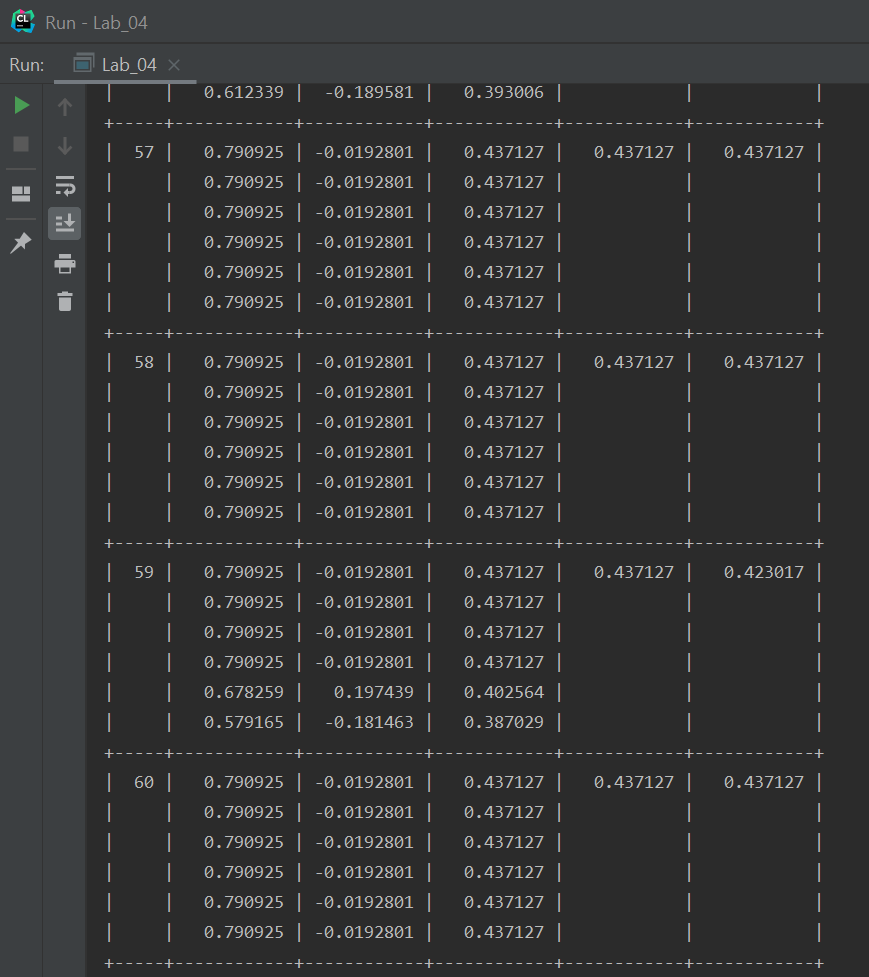

# Лабораторная работа №4 по Теории систем и системному анализу
Вариант 15
## Задание
Найти максимум функции f(x,y) = sin(x)*exp(-y^2)/(1 + x^2 + y^2) в области D помощью простого (классического) генетического алгоритма. 
За исходную популяцию принять 6 случайных  точек. Хромосома каждой особи состоит из двух генов: 
значений координат x, y. В качестве потомков следует выбирать результат скрещивания лучшего решения 
со вторым, третьим и четвертым в порядке убывания значений функции приспособленности с последующей случайной 
мутацией обоих генов. В качестве критерия остановки эволюционного процесса задаться номером конечной популяции. Визуализировать результаты расчетов.
Вероятность мутации 20%.
 
## Выполнение
Код файла, реализующего функцию имитации отжига, а также представляющего результаты в виде таблицы, приведен в main.cpp

